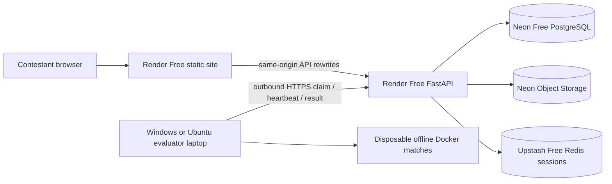

# FarmCraft free cloud deployment with a portable evaluator

## Architecture

`render.yaml` creates only the static site and one free web service. It creates no paid worker, disk, Render database, or Render Key Value service. PostgreSQL is the durable queue and source of truth. Redis remains only for browser sessions and local-mode worker controls. The evaluator can be offline without taking down the site or API; jobs accumulate in PostgreSQL.

## Current free-plan checks (8 October 2026)

Official [Render Free documentation](https://render.com/docs/free) says static sites and free web services are available, free web services sleep after 15 minutes of no inbound traffic, and the free workspace gets 750 instance-hours per month. Render's free filesystem is ephemeral. The [Neon Free announcement](https://neon.com/blog/neon-free-plan-1-gb-per-project) lists 1 GB PostgreSQL and 5 GB Object Storage per project, plus 100 CU-hours monthly per project; verify quotas in the Neon dashboard before the event. The [Upstash Free pricing page](https://upstash.com/pricing/redis) lists 500,000 commands/month and 256 MB. RQ's frequent idle polling was removed from cloud mode, but browser sessions still consume Redis commands. A worker left polling around the clock also keeps the Render API and Neon compute active, so stop it outside event hours to stay within free limits. No free tier offers a service-level uptime guarantee for this setup.

## Cloud setup

1. Create a Neon Free project and copy its **pooled** PostgreSQL connection string with TLS (`sslmode=require`). Enable Object Storage on the same project and create a private bucket. Copy its S3-compatible endpoint, region, access key, and secret. Verify the project's current region supports Object Storage.
2. Create an Upstash Redis Free database and copy the TLS `rediss://` endpoint. This is used for team sessions, not job dispatch. Keep the database on Free; do not enable paid auto-upgrade.
3. In Render, select the repository `OmKumar-2007/Kaggriculture` and the `farmcraft-free-remote` branch, then apply its `render.yaml` as a Blueprint in Om's workspace. Inspect the preview: it must show only `farmcraft-free-web` (static) and `farmcraft-free-api` (Free web). The existing `my-feature` Render services auto-deploy on push, so do not point this new Blueprint at them.
4. Supply all `sync: false` variables in the Dashboard. `ADMIN_PASSWORD_HASH` uses `pbkdf2_sha256$310000$SALT$HEX_DIGEST`; generate a fresh password and hash locally (see `start-server.ps1` for the format). Set `DATABASE_URL`, `REDIS_URL`, and all `OBJECT_STORAGE_*` values. `ADMIN_SESSION_SECRET` is generated by Render. Do not paste secrets into `render.yaml` or Git.
5. Confirm the assigned service names match the external rewrite destinations in `render.yaml`. Render may require unique service names; if renamed, update rewrite destinations, `PUBLIC_BASE_URL`, and `CORS_ORIGINS` before applying. The browser uses same-origin static-site rewrites, avoiding third-party cookie dependencies.
6. After both deploys are live, open `https://farmcraft-free-web.onrender.com/`, sign in to `/admin`, and check `/ready` on the API. On a cold start, the first API request can take about a minute. The frontend remains available while the API wakes.
7. From Admin → Workers & Devices, create a one-use registration token and run the portable setup on the evaluator laptop. Enter the **API** URL, not the static site URL. Start the worker. Confirm heartbeat and Docker health in Admin.
8. Submit a valid `main.py` using a test team, watch the job through queued, claimed, match, and result stages, and confirm its score appears on the leaderboard. Cancel a separate test job to verify container termination before opening the event.

Cloud data is separate from the current local Docker Compose volumes. Migrating existing teams and scores requires an explicit PostgreSQL dump/restore and artifact copy; this Blueprint does **not** silently move or overwrite local event data.

## Operational controls and recovery

- `QUEUE_BACKEND=postgres` stores jobs in `simulation_jobs`. Workers use `FOR UPDATE SKIP LOCKED` on PostgreSQL, unique attempt IDs, 90-second renewable leases, and ownership checks on results. A second submission for the same attempt returns HTTP 409 and cannot score twice.
- Admin cancellation changes durable state; the laptop receives it on heartbeat and stops the named Docker container. Emergency stop pauses all three queues and cancels running jobs. Pausing or draining one laptop stops new claims while active work finishes.
- If a laptop dies, lease recovery requeues ordinary jobs until `max_attempts`, then fails them. An interrupted tournament is marked for organizer review; the bracket is not silently restarted.
- Worker registration tokens expire in 15 minutes and are single use. Worker credentials are scoped to their own claim, source download, telemetry, replay upload, and result submission. Admin can revoke and re-register a laptop. Never distribute `credentials.json`.
- The admin pipeline shows actual persisted stage events and errors. Remote laptop telemetry includes CPU, available RAM, disk, Docker status, version, heartbeat, and concurrency. Queue and worker health should be checked before launching batches.

## Local development and costs

Local `docker-compose.yml`, RQ, and the host worker remain available with `QUEUE_BACKEND=redis`. Cloud mode uses `QUEUE_BACKEND=postgres`; fake simulation is explicitly `0` in the Blueprint. A cloud API request never runs contestant Python.

The Upstash 500,000-command allowance is workable for a short event with 60-second participant heartbeat, but command use rises with team count, admin monitoring, and session refreshes. Observe the Upstash dashboard. The Neon 100 CU-hour monthly allowance is a stronger constraint for an always-on polling worker. Run the evaluator during event windows, and keep backup exports. All free quotas can change or be exhausted; verify dashboards before relying on zero cost.

## Validation limits

The full Python suite passed **59/59** when run without concurrent builds; the frontend lint/build and Render Blueprint JSON Schema validation also passed. Automated tests cover registration reuse, duplicate names, authenticated source access, claim ownership, cancellation, expired lease recovery, idempotent result commit, and preserved leaderboard attribution. `python load_tests/remote_real_smoke.py` completed a real Docker sandbox game, an eight-game official evaluation rated **834.15**, a leaderboard commit, and cancellation of a hanging container with no orphan. That smoke used an isolated localhost HTTP API and database; cloud HTTPS and a separate laptop remain to be tested after provisioning. See `farmcraft-evaluator/README.md` for setup and migration.

The portable benchmark script also completed **one** real Docker game at concurrency 1 in **5.98 seconds** on the development laptop, with no failure. This single sample is only a script check. The requested 1/2/4/6/8 concurrency study must run on the actual 32 GB evaluation laptop before choosing its worker count; the current development laptop has under 8 GB RAM. The existing 100-user HTTP rehearsal is documented separately in `VALIDATION_REPORT.md` and uses fake results.
